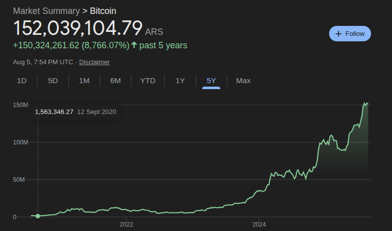
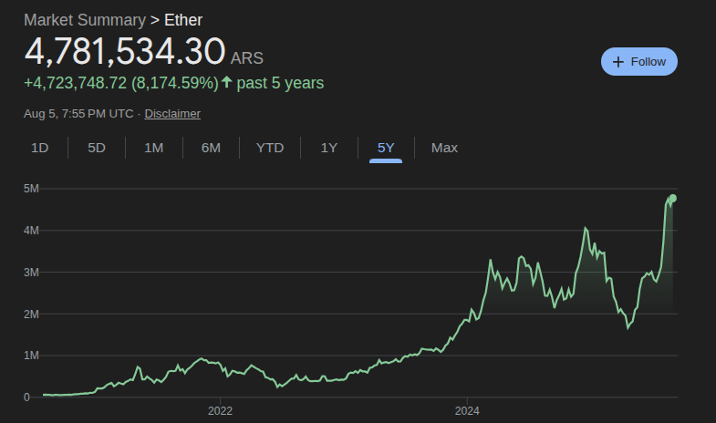
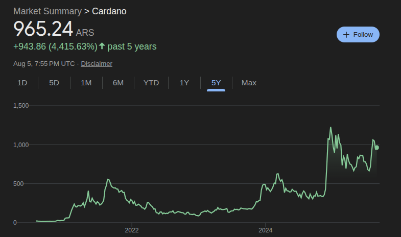

# Basic Research

## Overview of Cryptocurrencies

According to [Wikipedia](https://en.wikipedia.org/wiki/Cryptocurrency#:~:text=The%20first%20cryptocurrency%20was%20bitcoin,market%20capitalization%20exceeding%20%241%20billion.):

> A cryptocurrency (colloquially crypto) is a digital currency designed to work through a computer network that is not reliant on any central authority, such as a government or bank, to uphold or maintain it.

The first crypto was **bitcoin**, first released in 2009. As June of 2023, there were **more than 25,000 other cryptocurrencies** in the marketplace. An important feature that describe these currencies are their market capitalizacion, or "market cap", meaning the total value that they have in the market. 

> As of April 2025, the cryptocurrency market capitalization was already estimated at $2.76 trillion.

## Behind the scenes: virtual generation of cryptos

How do cryptocurrencies work? How are they created and operated? Understanding these aspects may help to better predict price fluctuations and special events.

A very important concept for cryptos is that they are produced in an **entire cryptocurrency system collectively**, at a rate that is defined when the system is created and that is publicly stated. As cryptos are virtual, they need to be monitored by virtual means, which brings into account the concept of **blockchain**:

> The validity of each cryptocurrency's coins is provided by a blockchain. A blockchain is a continuously growing list of records, called blocks, which are linked and secured using cryptography.

The validation of transactions on a blockchain is known as **mining**. Using computers, users can validate a transaction, obtaining new cryptocurrency as a reward.

## Most valued cryptos

Using the website [coinmarketcap](https://coinmarketcap.com/) as a reference, I get the most valued cryptocurrencies as today 2025-08-05, 16:50 GMT-3, according to their **Market Cap**:

1. Bitcoin (BTC), $2.26 \times 10^{12}$ USD.
2. Ethereum (ETH), $0.43 \times 10^{12}$ USD.
3. XRP (XRP), $0.18 \times 10^{12}$ USD.
4. Tether (USDT), $0.16 \times 10^{12}$ USD.
5. BNB (BNB), $0.10 \times 10^{12}$ USD.
6. Solana (SOL), $0.09 \times 10^{12}$ USD.
7. USDC (USDC), $0.06 \times 10^{12}$ USD.
8. TRON (TRX), $0.03 \times 10^{12}$ USD.
9. Dogecoin (DOGE), $0.03 \times 10^{12}$ USD.
10. Cardano (ADA), $0.03 \times 10^{12}$ USD.

## Fluctuations in time

The following plots show the evolution of **bitcoin**, **ethereum** and **cardano** in the last 5 years.

Although the price scales are different, all plots share a common feature: the prices are not stable in such a long period as 5 years, showing increments of more than 1000 times the initial price.

## Ideas

In this section, I include some ideas that may be useful for working with cryptocurrency data and forecasting future prices.

### Related industries

The fluctuations in cryptos may strongly affect other industries or, by the contrary, be affected by them. For example, mining cryptos requires computing power, and Graphic Processing Units (GPU) are great tools for speeding up the process. Then, **the price of cryptos may be related to the stockmarket price of companies such as NVIDIA**.

### Power outages

What about power outages? Interruptions in the energy supply may affect the mining activity, and maybe there are security issues as well. Then, **adding historical data for power outages in different countries**, e.g. China and USA, may provide useful information.

### News

Life is not a Physics problem, and up to date there is no mathematical model that can predict the price of cryptocurrency. Politics, international relationships between countries and companies, climate events and many other factors affect the world's economy and finances. And also the cryptocurrency evolution. Therefore, it should be helpful to have some indicator about the real-world situation for future price predictions. Along these lines, **including some news-related indicator, such as financial news, could benefit a Machine Learning model to learn about cryptos and their evolution**.