# Crypto Pipeline Project <a id="top"></a>

<div style="display: flex; align-items: center; gap: 10px;">
  <p>This project is a comprehensive implementation of a full pipeline to first extract, load and transform (ETL) cryptocurrency information from the CoinGecko API, followed by data analysis and Machine Learning models to predict the price of cryptocurrency in the future.</p>
  
</div> 


## Table of contents <a id="toc"></a>

- [Overview of the project](#overview)
- [Project layout](#layout)
- [How to install](#install)
    - [Docker](#docker)
    - [PostgreSQL](#postgresql)
    - [Coingecko API](#coingecko)
- [Guides for each stage](#guides)
    - [Stage 1: API requests](#task1)
        - [Daily CRON](#daily)
    - [Stage 2: Database loading](#task2)
        - [Load daily table](#task2-daily)
    - [Stage 3: Data analysis](#task3)
        - [Obtaining averages](#task3-averages)
        - [Analyzing streaks](#task3-streaks)
    - [Stage 4: Machine Learning predictions](#task4)
        - [Price history](#task4-price-history)
        - [Evaluate risks](#task4-evaluate-risks)
        - [Trend and variance](#task4-trend-and-variance)
        - [Lagged prices and calendar features](#task4-lagged-prices)
        - [Machine Learning predictions](#task4-ML-predictions)
- [Conclusions](#conclusions)
- [Upgrade perspectives](#perspectives)
    - [Easier interfacing for users](#p0interfacing)
    - [Stage 1: Skip duplicates](#perspectives1)
    - [Stage 2: API+Postgres Integration](#perspectives2)
    - [Stage 3: Missing values sanity check](#perspectives3)
    - [Stage 4: Dockerization and XGBRegressor](#perspectives4)
- [License](#license)

## Overview of the project <a id="overview"></a>

This project is about designing a whole **pipeline for processing cryptocurrency information and make predictions in the future**. 

Across 4 different stages, I have managed the various stages of the process, starting by the **Extract, Transform and Load (ETL)** process, then I have performed **data analysis and engineering**, and finally built **Machine Learning (ML) models** that can predict the price of cryptocurrency 1 day ahead, based on the previous 7 days activity and other features. 

The entire workflow has been divided in 4 stages or tasks:

1. Request raw information from CoinGecko API and store data files locally.
2. Transform local information and load it into a Postgres database instance.
3. Analyze data using SQL queries.
4. Build ML models and predict future prices of cryptocurrency.

## Project layout <a id="layout"></a>

As a reference guide for the **repository file structure**, I show a diagram with the most relevant files:

```
.
├── assets/                      # Images for the README
├── codes/                       # Source code and scripts for each task
│   ├── 1_task1/                 # Code for API requests
│   │   ├── crypto_datafiles/    # Local storage for data files from the API
│   ├── 2_task2/                 # Code for loading information into Postgres
│   ├── 3_task3/                 # Code for data engineering using SQL
│   │   ├── data/                # Local storage for static dataset
│   └── 4_task4/                 # Code for data analysis and ML models
│       ├── images/              # Images for data analysis and ML predictions
├── Basic_research.md            # Notes on research background
└── README.md                    # Project overview and instructions
```

## How to install <a id="install"></a>

In the next subsections, I explain how to set up your local environment to run this project. As a general reference, I've used **Python 3.12** and built a Docker setup using **Docker 28.3**.

Reference (used to develop the solutions):

- **OS:** Ubuntu 24.04.2 LTS.
- **CPU:** 13th Gen Intel® Core™ i7-13700HX × 24.
- **RAM:** 32 GB.
- **GPU:** NVIDIA GeForce RTX™ 4060.

### Docker <a id="docker"></a>

The official Docker website offers a guide to install Docker in any operating system: [link to Docker installation guide](https://docs.docker.com/engine/install/). Here are the instructions for Ubuntu:

```shell
# Open a terminal and run the following commands

# Uninstall possible conflicting packages:
for pkg in docker.io docker-doc docker-compose docker-compose-v2 podman-docker containerd runc; do sudo apt-get remove $pkg; done

# Add Docker's official GPG key:
sudo apt-get update
sudo apt-get install ca-certificates curl
sudo install -m 0755 -d /etc/apt/keyrings
sudo curl -fsSL https://download.docker.com/linux/ubuntu/gpg -o /etc/apt/keyrings/docker.asc
sudo chmod a+r /etc/apt/keyrings/docker.asc

# Add the repository to Apt sources:
echo \
  "deb [arch=$(dpkg --print-architecture) signed-by=/etc/apt/keyrings/docker.asc] https://download.docker.com/linux/ubuntu \
  $(. /etc/os-release && echo "${UBUNTU_CODENAME:-$VERSION_CODENAME}") stable" | \
  sudo tee /etc/apt/sources.list.d/docker.list > /dev/null
sudo apt-get update

# Install the Docker packages:
sudo apt-get install docker-ce docker-ce-cli containerd.io docker-buildx-plugin docker-compose-plugin

# Verify that the installation is successful by running the hello-world image:
sudo docker run hello-world

# This command downloads a test image and runs it in a container. When the container runs, it prints a confirmation message and exits.
```

It is possible that your Docker installation does not give full permissions to your user. For my Ubuntu environment, a created a bash script that gets all user permissions to run Docker, you can run it as follows:

```shell
# Give permissions to the script
chmod +x activate_docker.sh

# Set the correct docker permissions
./activate_docker.sh

# As prompted by the previous command output, run the following command
docker ps

# It should list all the containers without needing root privileges, meaning your user has correct permissions.
```

### PostgreSQL <a id="postgresql"></a>

[PostgreSQL](https://www.postgresql.org/) is an object-relational database that I will use to store our data. To set up a Postgres image using Docker, follow [this guide](https://hub.docker.com/_/postgres).

Ubuntu instructions:

```shell
# Install the Postgres image (choose your own name and password) and set it to listen on Port 5432
$ docker run --name <postgresname> -e POSTGRES_PASSWORD=<password> -p 5432:5432 -d postgres
```

<div style="background-color:#ffeeba; padding:10px; border:1px solid #d39e00; border-radius:4px; color:#000; margin-bottom:15px;">
<p>
⚠️ <strong>Important:</strong> if you are replicating this project, at this point you have to create your <code style="background:#f8f9fa; padding:2px 4px; border-radius:4px; color:#000;">.env</code> file for local variables, which will be read later by the source code. The <code style="background:#f8f9fa; padding:2px 4px; border-radius:4px; color:#000;">.env</code> file is ignored by Git, so you can safely store sensitive information there: it will only be accessible in your local environment.
</p>
<p style="margin:0;">
In the root folder of the repository, there is a file called <code style="background:#f8f9fa; padding:2px 4px; border-radius:4px; color:#000;">.env.template</code> which holds all the required variables.
</p></div>

**Instructions: make a copy of this file and save it as `.env`.** There, update the Postgres credentials: 

- POSTGRES_USER=your_username
- POSTGRES_PASSWORD=your_password

At this point, a Docker container has already been created with the postgres instance. Here are some useful commands to manage Docker:

```shell
# See all active containers:
docker ps

# See all active and inactive containers:
docker ps -a

# Stop a container (set inactive):
docker stop <container_name>

# Remove a docker container (must be inactive):
docker rm <container_name>

# Start a container (set active):
docker start <container_name>
```

It is also necessary to install the **postgresql-client (psql)**, the instructions can be found in this [guide](https://www.tigerdata.com/blog/how-to-install-psql-on-mac-ubuntu-debian-windows).

For Ubuntu:
```shell
# Install psql (the PostgreSQL command-line client):
sudo apt update
sudo apt install postgresql-client

# Check your version, should 16.9 or higher:
psql --version
```

It's time to check that everything is running correctly, so let's access to the postgres instance that you've created before using a shell command:

```shell
# Connect to the Docker instanc (it asks for your password):
psql -h localhost -p 5432 -U postgres

# You can exit from psql by using the command 'exit'
```

If the connection was successful, an output like this should appear:

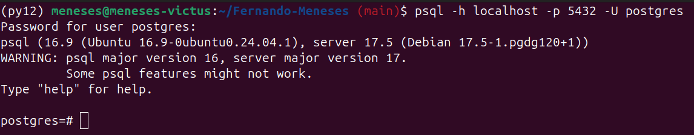

### Coingecko API <a id="coingecko"></a>

The cryptocurrency information for this project will come from the [Coingecko](https://docs.coingecko.com/v3.0.1/reference/introduction) API. Although Coingecko allows free requests without an API key, the service is limited in that way, see the [official website](https://support.coingecko.com/hc/en-us/articles/4538771776153-What-is-the-rate-limit-for-CoinGecko-API-public-plan).

In order to improve our data resources, I will work with the **free demo version**, which provides the following benefits:

- 30 calls/min.
- 10,000 montly credits.
- Access to 1-year historical data.

For the free demo version, it's necessary to get a personal **API key** by following [these instructions](https://docs.coingecko.com/v3.0.1/reference/setting-up-your-api-key).

To check that the API key has been successfully created, the developers/dashboard [section in CoinGecko](https://www.coingecko.com/en/developers/dashboard) should look like this:

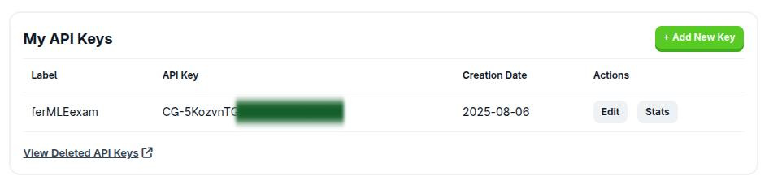

<div style="background-color:#ffeeba; padding:10px; border:1px solid #d39e00; border-radius:4px; color:#000; margin-bottom:15px;">
<p style="margin:0;">
⚠️ <strong>Important:</strong> if you are replicating this project, never share your API key with anyone nor post it publicly. To use the API key in this project, you have to safely store it in the <code style="background:#f8f9fa; padding:2px 4px; border-radius:4px; color:#000;">.env</code> file.
</p></div>

**Instructions: register the API key in the `.env` file:** 

- COINGECKO_API_KEY=your_api_key_here

To check that you API is working, one easy way is by using the Ping Endpoint and replacing `your_API_key` by the correct value:

```
https://api.coingecko.com/api/v3/ping?x_cg_api_key=your_API_key
```

The following output should appear:

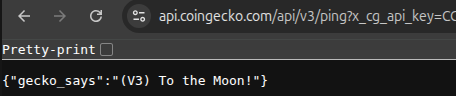

## Guides for each stage <a id="guides"></a>

The following documentation allows the reader to replicate the entire project code step-by-step and interpret the outcomes. As the whole project is about **cryptocurrency**, it is a good idea to have some background on the topic, so decisions are driven by knowledge. The `Basic_research.md` file (in the root folder) is a brief guide to criptocurreny that I've made focusing on critical aspects, feel free to explore it!

**IMPORTANT**: the python scripts are prepared to run using Docker, as it will be explained later. If the reader prefers to directly run the python scripts, first they have to access the file, follow the instructions and uncomment certain lines that enables direct running.

### Stage 1: API requests <a id="task1"></a>

In the CoinGecko API there is information for over 3,000 cryptocurrencies, but in this project we will only focus in three specific coins:

- `bitcoin`.
- `ethereum`.
- `cardano`.

In this stage, I've been guided by the following goals:

<div style="background-color:#b6f08aff; padding:10px; border:1px solid #b6f08aff; border-radius:4px; color:#000; margin-bottom:15px;">

1. Create a **command line Python app** that receives an ISO8601 date (e.g. 2017-12-30) and a coin identifier (e.g. bitcoin), and downloads data from /coins/{id}/history?date=dd-mm-yyyy endpoint for that whole day and stores it in a local file.

2. Add proper Python logging to the script, and configure a CRON entry that will run the app every day at 3am for the identifiers `bitcoin`, `ethereum` and `cardano`.

3. Add an option in the app that will bulk-reprocess the data for a time range. It will receive the start and end dates, and store all the necessary days’ data.

</div>

My approach is coded in `/codes/1_task1/main.py`, and it is prepared to run from Docker. The code includes the following features:

- It reads your `API_KEY` located in the `.env` file and has the demo permissions.
- The requests can be run for a single coin at a time, for a single day or a continuous time span.
- Each request can be parallelized to speed up the process.
- As you may hit the request's frequency limit, the code incorporates a mechanism to perform many attempts (default 5), waiting an increasing amount of time between attempts, until the requests proceeds or it reaches the attempt limit. In the later case, that pull request is cancelled and the script goes on with the next request.

As a first step, it's necessary to build the docker container, which I name `api_request`:

```shell
docker build -t api_request .
```

Next, in order to run the main script, there are two options:

1. **Single-day request**. In this case, run the following command:

```shell
docker run \
  --rm \   # Automatically remove the container when it exits
  --env-file "$(realpath ../../.env)" \   # Load environment variables from .env file
  -u $(id -u):$(id -g) \   # Run container with the current user's UID and GID (avoids permission issues)
  -v "$(pwd)/crypto_datafiles:/app/crypto_datafiles" \   # Mount local folder to container's /app/crypto_datafiles
  api_request:latest \   # Docker image name and tag
  <coin> \   # Positional argument for the coin ID (e.g. bitcoin)
  <date>     # Positional argument for the date (YYYY-MM-DD)
```

For example:
```shell
docker run --rm --env-file "$(realpath ../../.env)" -u $(id -u):$(id -g) -v "$(pwd)/crypto_datafiles:/app/crypto_datafiles" api_request:latest cardano 2025-01-17 
```

2. **Bulk process**, for a date range and option for concurrent processing. In this case, run the following command:

```shell
docker run \
  --rm \   # Automatically remove the container when it exits
  --env-file "$(realpath ../../.env)" \   # Load environment variables from .env file
  -u $(id -u):$(id -g) \   # Run container with the current user's UID and GID (avoids permission issues)
  -v "$(pwd)/crypto_datafiles:/app/crypto_datafiles" \   # Mount local folder to container's /app/crypto_datafiles
  api_request:latest \   # Docker image name and tag
  --bulk \ # Allows bulk processing
  --start <YYYY-MM-DD> \ # Initial date for the time interval
  --end <YYYY-MM-DD> \ # Final date for the time interval
  --workers <N> \ # Number of workers for concurrent requests (default=1)
  <coin> \   # Positional argument for the coin ID (e.g. bitcoin)
```

For example:
```shell
docker run --rm --env-file "$(realpath ../../.env)" -u $(id -u):$(id -g) -v "$(pwd)/crypto_datafiles:/app/crypto_datafiles" api_request:latest --bulk --start 2024-09-01 --end 2025-07-31 bitcoin
```

#### Daily CRON <a id="daily"></a>

Finally, let's configure the CRON entry that will run the app every day at 3am. Because I'm using docker, there could be some issues with the relative paths, **so the reader has to set your absolute paths manually**. Follow these instructions:

1. Open the file `/codes/1_task1/run_daily.sh`.

2. Find the path from your home directory to the root folder of this repository.

3. Replace that path for <YourPath> in lines 5 and 6, for variables `ROOT` and `ENV_FILE`. In Ubuntu, the relevant path can be found by opening a shell in the root directory of this repository and then running the command:

```shell
# Run in the root directory of the project
pwd
```

4. Check the docker path in line 8, for variable `DOCKER`. To find the path, the reader can run the following command in the shell:

```shell
which docker
``` 

If the path is different than "/usr/bin/docker", update it accordingly.

5. The file `run_daily.sh` is ready, close it.

6. Open a shell from the folder in which `run_daily.sh` is located.

7. Make the script executable by running:

```shell
chmod +x run_daily.sh
```

8. Check that the script is working by executing it manually:

```shell
./run_daily.sh 
```

The reader should get the API response and new files generated in the folder `/codes/1_task1/crypto_datafiles/`.

9. Edit the crontab by running:

```shell
crontab -e
```

A new shell should open.

10. Go to the end of the shell and paste the following lines, replacing <YourPath> accordingly:

```shell
SHELL=/bin/bash
PATH=/usr/local/sbin:/usr/local/bin:/usr/sbin:/usr/bin:/sbin:/bin

* 3 * * * <YourPath>/codes/1_task1/run_every_60_seconds.sh
```

11. Save the crontab by pressing CTRL+S and then exit by pressing CTRL+X.

12. Check that the crontab is updated by running:

```shell
crontab -l
```

The reader should see the lines that they pasted before.

Done! The job is scheduled to run daily at 3am.

### Stage 2: Database loading <a id="task2"></a>

In this Task, I will load the Postgres database with the **local files downloaded in Task 1**, and also with an **alternative, older dataset**. Let's see the goal for this stage:

<div style="background-color:#b6f08aff; padding:10px; border:1px solid #b6f08aff; border-radius:4px; color:#000; margin-bottom:15px;">
<p style="margin:0;">
Create two tables in Postgres. The first one should contain the coin id, price in USD, date and a field that stores the whole JSON response. The second table should aggregate data: it should contain the coin id, the year and month and the maximum/minimum values for that period.
</p></div>

As a first step, make sure the postgres instance is running:

```shell
# In a shell:
docker ps

# You should the postgres image you activated at the beginning. If not, start it:
docker start <container_name>
```

In my environment, the `docker ps` output looks like this:

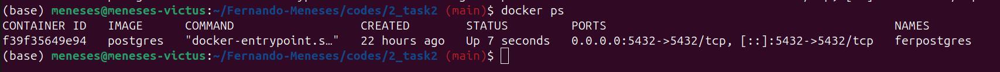

#### Load daily table <a id="task2-daily"></a>

Now, make sure that the working folder is `/codes/2_task2/`. I start by building the table for daily data, and the first step is **designing the schema**. In a shell, run the following command:

```shell
# Run and input your password when prompted:
psql -h 127.0.0.1 -U postgres -d postgres -f create_table1_daily_schema.sql 
```

If successful, there should be an output `"CREATE TABLE"` on screen, similar to this one:

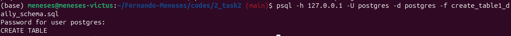

The created table can be checked in the PostgreSQL instance using psql:

```shell
# Enter psql (it prompts for password)
psql -h 127.0.0.1 -U postgres -d postgres

# List tables (you should see 'crypto_daily_data' there):
\dt

# Explore your table:
\d crypto_daily_data

# Exit table view:
q

# Exit postgres:
exit
```

The reader should see something like this:

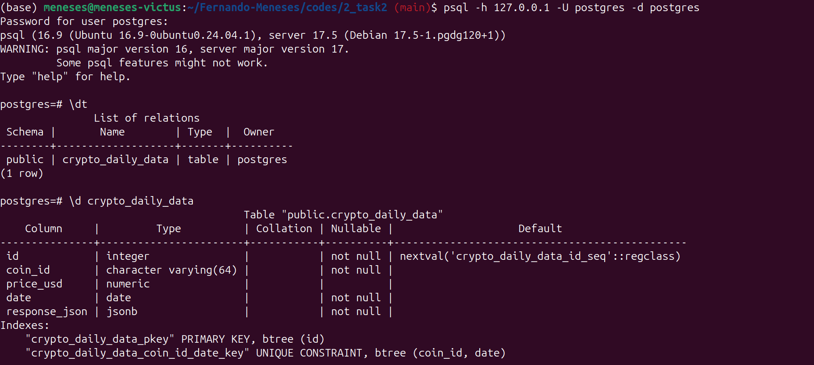

Now that the `crypto_daily_data` table exists, I will populate it with the information from the local data files downloaded in Task 1:

- `bitcoin`: from 2024-09-01 to 2024-07-31.
- `cardano`: from 2024-09-01 to 2024-07-31.
- `ethereum`: from 2024-09-01 to 2024-07-31.

I will start by building the docker container, named `load_postgres`:

```shell
docker build -t load_postgres .
```

Next, run the following script to load the postgres database:

```shell
docker run --rm \
  --env-file "$(realpath ../../.env)" \
  --add-host=host.docker.internal:host-gateway \
  -u $(id -u):$(id -g) \
  -v "$(realpath ../..):/app" \
  load_postgres:latest
```

There is an additional configuration `--add-host=host.docker.internal:host-gateway` for this docker command, because I'm running a database connection from inside the container, so I need to set the connection properly. Notice that if the reader wants to run the python script `main2.py` directly, there are instructions in the file to uncomment certain lines.

If the loading command was run successfully, there should be an output like this:

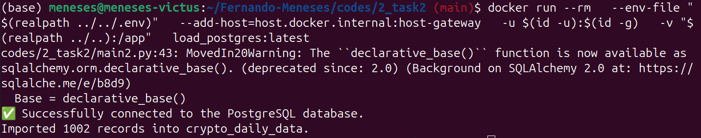

If the reader runs the docker command again, they should get repeated logs telling you that the entries are already loaded in the table:

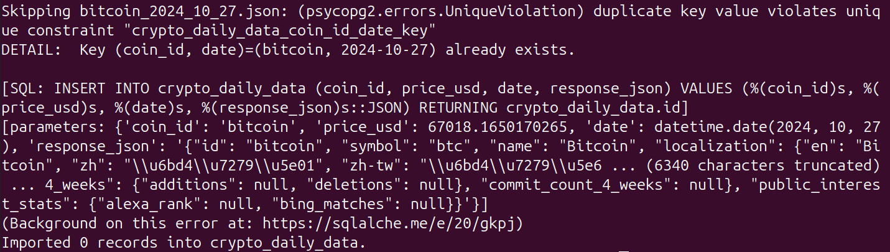

That's alright, it means that the information is already in the table!

Alternatively, the information in the postgres table can be checked by running the following commands in a shell:

```shell
# Access postgres (it requires your password)
psql -h 127.0.0.1 -U postgres -d postgres

# Print table values via SQL
SELECT id,coin_id,price_usd,date FROM crypto_daily_data LIMIT 10;

# Exit
exit
```

The table should look like this:

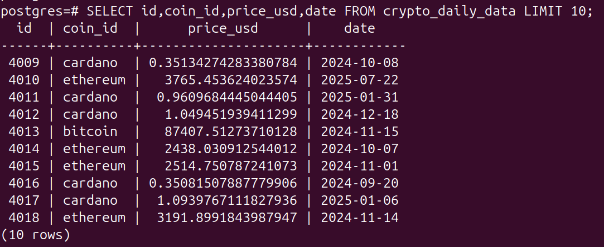

#### Build aggregated table <a id="task2-daily"></a>

In order to build the table with aggregated information about the daily data, named `crypto_aggregated_info`, I use a SQL query that reads the `crypto_daily_data` table in Postgres and make aggregation operations. The schema is the following:

- id (serial)
- coin_id (text or varchar)
- year (integer)
- month (integer)
- max_price_usd (numeric/float)
- min_price_usd (numeric/float)

First, create the table schema by running this shell command:

```shell
# Run and input your password when prompted:
psql -h 127.0.0.1 -U postgres -d postgres -f create_table2_aggregated_schema.sql 
```

Then, run a second query that populates the `crypto_aggregated_info` table with the appropriate aggregation:

```shell
# Run and input your password when prompted:
psql -h 127.0.0.1 -U postgres -d postgres -f populate_table2.sql 
```

If successful, there should be an output like this, which informs about the new insertions in the table:

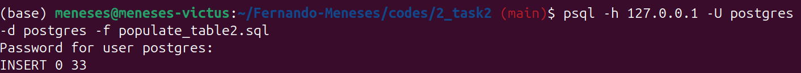

If the reader wants to take a look at the table from Postgres, run the following commands:

```shell
# Access postgres (it requires your password)
psql -h 127.0.0.1 -U postgres -d postgres

# Print table values via SQL
SELECT * FROM crypto_aggregated_info LIMIT 10;

# Exit
exit
```

This is an example of how `crypto_aggregated_info` should look like:

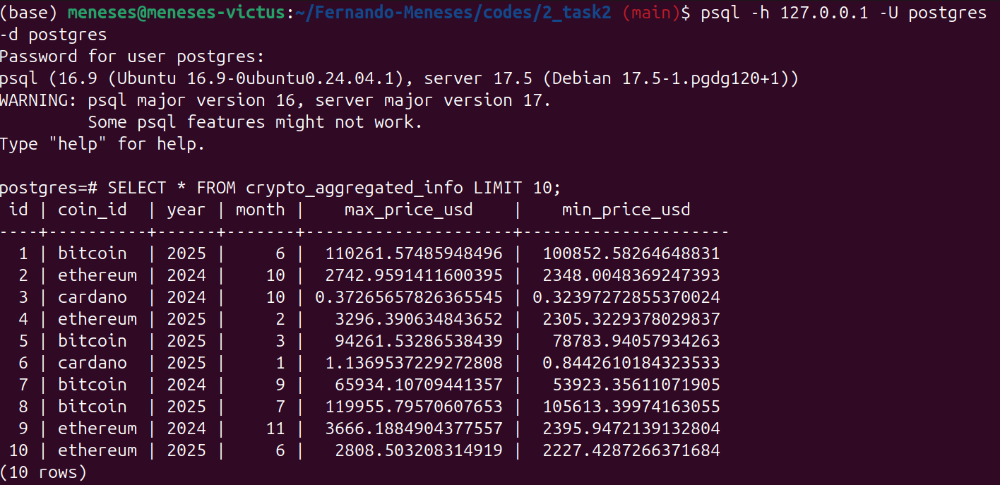

### Stage 3: Data analysis <a id="task3"></a>

In this stage, I analyze the data from table `crypto_daily_data`, previously stored in the postgres database. Alternatively, I also prepare files to work with the alternative, older dataset.

In order to load the alternative dataset, move to the folder `./codes/3_task/` directory and run the following command in a shell:

```shell
# Map the SQL file between the docker and the local host:
docker cp data/coin_data.sql <your_docker_container_name>:/coin_data.sql

# Execute the container:
docker exec -it <your_docker_container_name> bash

# Once in the container, access to postgres:
psql -U postgres

# Once in postgres, run the SQL query:
\i /coin_data.sql

# Exit from postgres:
exit

# Exit from the container:
exit
```

If the information was successfully uploaded, then the new tables `coin_data` and `coin_month_data` in postgres can be seen by running the following commands in a shell:

```shell
# Access postgres (it requires your password)
psql -h 127.0.0.1 -U postgres -d postgres

# Print table values via SQL
\dt

# Exit
exit
```

There should be an output similar to this one:

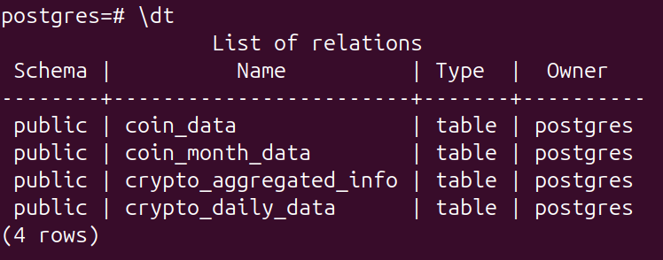

If the reader wants to dive into the `coin_month_data` table (alternative dataset), they will discover that the data covers the period **from 01-2021 to 09-2021 for the cryptocoins bitcoin, ethereum and cardano**. Check this information by running this SQL query:

```shell
# Enter psql (it requires your password)
psql -h 127.0.0.1 -U postgres -d postgres

# Obtain all rows from the table, ordered by month
SELECT * FROM coin_month_data ORDER BY month;

# Exit
exit
```

#### Obtaining averages <a id="task3-averages"></a>

I created two SQL queries `crypto_daily_data_avg_price.sql` and `coin_data_avg_price.sql` for obtaining averages, working with the API downloaded data or the alternative dataset. Both queries share the same logic, but the source table and variables are different.

The first query, working with table `crypto_daily_data`, can be run from a shell:

```shell
# Run the SQL query in the postgres instance (it asks for your password) and print the results on screen
psql -h 127.0.0.1 -U postgres -d postgres -f crypto_daily_data_avg_price.sql
```

The reader should get an output similar to this one:

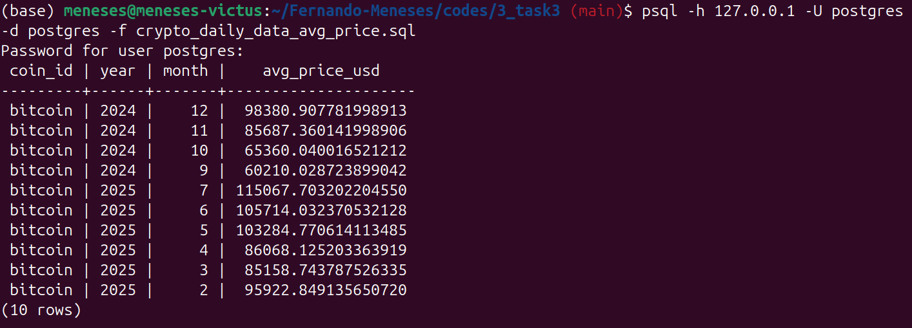

Now, run the SQL query for the table `coins_month`:

```shell
# Run the SQL query in the postgres instance (it asks for your password) and print the results on screen
psql -h 127.0.0.1 -U postgres -d postgres -f coin_data_avg_price.sql
```

This time, the results should reflect the period 2021-01 to 2021-09. 

#### Analyzing streaks <a id="task3-streaks"></a>

Getting averages was relatively easy, I now advance to a more advanced analysis:

<div style="background-color:#b6f08aff; padding:10px; border:1px solid #b6f08aff; border-radius:4px; color:#000; margin-bottom:15px;">
<p style="margin:0;">
Calculate for each coin, on average, how much its price has increased after it had dropped consecutively for more than 3 days. In the same result set include the current market cap in USD (obtainable from the JSON-typed column).
</p></div>

Some clarifications:

- When the goal says *"on average"*, I'm following this logic:
    - In the chosen time span, check first the number of streaks of consecutive price drops for more than 3 days. Let's call this quantity $N$.
    - For each one of these streaks, get the price jump from the last day in the streak to the new, higher price. Let's call this quantity $p_{i}$.
    - The *"average"* is calculated as the sum of all $p_{i}$ divided by $N$.

I see the following problem for this approach:

- What if the last streak does not have a recovery day because the data entries finished before a recovery? In this case, there will be $(N-1)$ recoveries but $N$ streaks.

**Decision: define a streak as a more-than-3-days consecutive drop in price followed by a price increase. If there is no price increase, this period of time is not counted towards the average that we want to calculate.**

Furthermore, I have added more features to the output table to have a more complete picture of the analysis. The full schema of the output SQL table is the following:

- `coin_id`: cryptocoin, such as 'bitcoin'.
- `avg_recov_usd`: average recovery price, in USD, for more-than-3-days streaks of consecutive drop in price followed by a price increase.
- `num_streaks`: number of streaks as defined previously.
- `last_date`: last available date in the chosen time span.
- `first_date`: first available date in the chosen time span.
- `time_span_days`: total number of days in the time span.
- `latest_market_cap_usd`: market cap, in USD, for the cryptocoin at the last available data in the time span.

I'm ready to proceed now. I have created two SQL files, one for each dataset:

- `SQL_streaks_3days_drop_coin_data.sql` works with the `coin_data` table.
- `SQL_streaks_3days_drop_crypto_daily_data.sql` works with the `crypto_daily_data` table.

In both queries, I have added a **functionality to select the time span to analyze**. To run the SQL query in postgres, following inputs must be specified:

- `init_date`: Initial date for the time span in the analysis. It must be in ISO8601 format supplied as a string, such as '2021-01-25'. If the input is an empty string '', then the initial date will be the first available date in the table.

- `final_date`: Initial date for the time span in the analysis. It must be in ISO8601 format supplied as a string, such as '2021-03-04'. If the input is an empty string '', then the final date will be the final available date in the table.

*Note: if the initial and final input dates do not produce a valid time span, the query will run anyway and return a table with 0 rows.*

The command to run any of the SQL queries from a shell is the following:

```shell
# Run the SQL query in the postgres instance (it asks for your password) and print the results on screen
psql -h 127.0.0.1 -U postgres -d postgres \
  -v init_date=<init_date> \
  -v final_date=<final_date> \
  -f <SQL_query>
```

For example, to run a query on a restricted time period in the `crypto_daily_data` table:

```shell
psql -h 127.0.0.1 -U postgres -d postgres \
  -v init_date='2025-05-02' \
  -v final_date='' \
  -f SQL_streaks_3days_drop_crypto_daily_data.sql
```

After running the query, the output should look like:

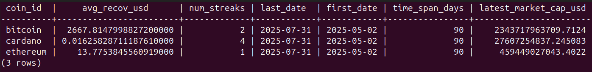

On the other hand, if the query is set to analyze the data in the entire `coin_data` table:

```shell
psql -h 127.0.0.1 -U postgres -d postgres \
  -v init_date='' \
  -v final_date='' \
  -f SQL_streaks_3days_drop_coin_data.sql
```

And the output should be the following one:

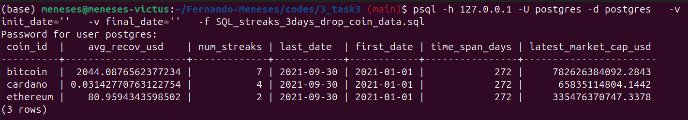

### Stage 4: Machine Learning predictions <a id="task4"></a>

As the final stage in this project, I predict the future prices of cryptocurrency, 1 day ahead. In this section, I use python scripts directly, with version Python 3.12.*.

#### Price history<a id="task4-price-history"></a>

Let's start with a simple goal:

<div style="background-color:#b6f08aff; padding:10px; border:1px solid #b6f08aff; border-radius:4px; color:#000; margin-bottom:15px;">
<p style="margin:0;">
Plot the prices of selected crypto coins for the last $N$ days, from a given date.
</p></div>

The script for this activity is `view_price_history.py`, and accepts several arguments:

```shell
# Run from shell in ./codes/4_task4/ folder
python view_price_history.py \ # Basic command, can run as standalone
  --table <table> \ # Select either crypto_daily_table (default) or coin_data
  --coins <coin or coins> \ # Select coins to be analyzed, separated by space, default: all
  --last_date <YYYY-MM-DD> \ # Select the last date, default: latest
  --days <N> \ # Select the number of days to look back into, default: 30
  --save_image <True> # Condition to save image, default: False
```

Here are some examples along with their output images:

```shell
python view_price_history.py --coins cardano --days 100 --last_date 2025-05-05 --save_image True
```

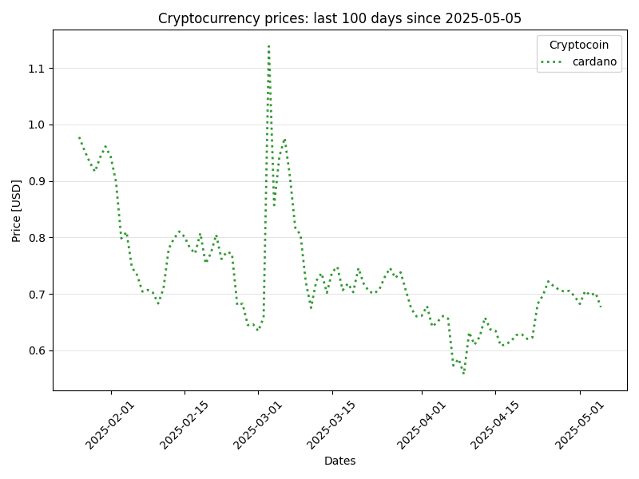

```shell
python view_price_history.py --table coin_data --save_image True
```

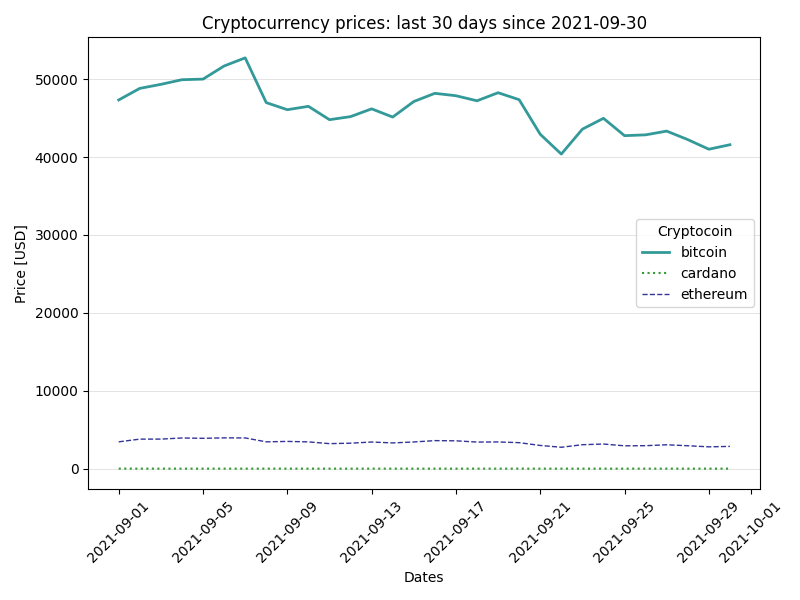

#### Evaluate risks<a id="task4-evaluate-risks"></a>

As a next step, I set the goal of assigning risk types to each cryptocurrency:

<div style="background-color:#b6f08aff; padding:10px; border:1px solid #b6f08aff; border-radius:4px; color:#000; margin-bottom:15px;">
<p style="margin:0;">
Define 3 types of coins: “High Risk” if it had a 50% price drop on any two consecutive days, during a given calendar month, “Medium risk” if it dropped more than 20%, and “Low risk” for the rest (in this same fashion of consecutive days).
</p></div>

Here, "price drop on any two consecutive days" might be interpreted in two different ways, which I illustrate with the following example of coin prices (days are consecutive):

```python
series_A = [100,110,100,40,60,20,15,20]
```

```python
series_B = [100,110,100,40,60,20,5,5]
```

1. If I consider "price drop on any two consecutive days" in the sense that the price dropped from day $T_{i}$ to day $T_{i+1}$, then both `series_A` and `series_B` qualifies as `High risk`, because there the price dropped 50% from 100 to 40, and that's enough.

2. On the contrary, if "price drop on any two consecutive days" means that the price of day $T_{i+1}$ must be at least 50% lower than the price of the day $T_{i}$, AND the same must occur for days $T_{i+2}$ and $T_{i+1}$, then only `series_B` is `High risk`, because the price dropped from 60 to 20, and then from 20 to 5. In `series_A`, instead, such double 50% drop does not occur.

**Decision: introduce a new parameter named `drop_streak_days` that defines the criterion for consecutive drops in price**.

If `drop_streak_days`=1, then the algorithm follows the criterion explained in point 1.

If `drop_streak_days`=2, then the algorithm follows the criterion explained in point 2.

The parameter can be applied to any number $N \geq 1$.

The script for this activity is `assign_risk.py`, which accepts several arguments:

```shell
# Run from shell in ./codes/4_task4/ folder
python assign_risk.py \ # Basic command, can run as standalone
  --table <table> \ # Select either crypto_daily_table (default) or coin_data
  --streak_days <N> \ # Select the number of days for dropping-streak criterion, default: 1
  --risk_period_days <N> # Select the period, in days, for the evaluation period, default: 30
```

The results are displayed as a screen output and the updated dataframe is returned. I show an example for the `crypto_daily_data` table, using the softest criterion `streak_days=1` (default) and `risk_period_days=30` (default):

```shell
# Run from shell in ./codes/4_task4/ folder
python assign_risk.py --table crypto_daily_data
```

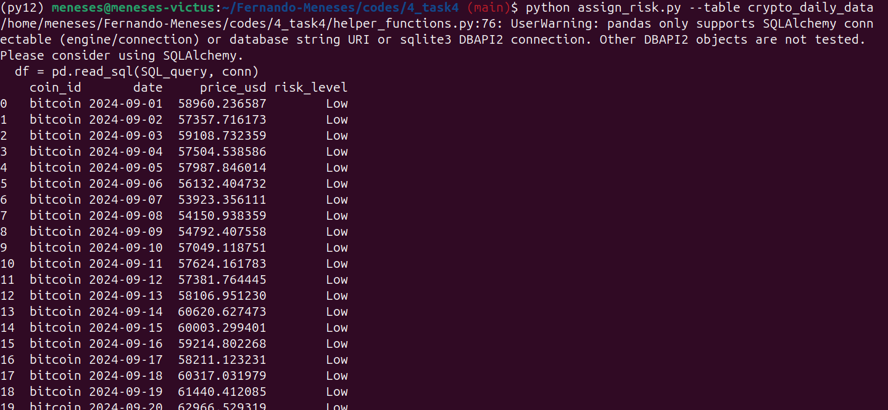

#### Trend and variance <a id="task4-trend-and-variance"></a>

In this section, I analyze the *general trend* and variance for each day:

<div style="background-color:#b6f08aff; padding:10px; border:1px solid #b6f08aff; border-radius:4px; color:#000; margin-bottom:15px;">
<p style="margin:0;">
For each row-day, add a column indicating the general trend of the price for the previous 7 days (T0 vs. T-1 through T-7), and the variance of the price for the same 7 days period.
</p></div>

To avoid any confusions, I clarify the indexing: the current day is T0, one day before is T-1, and so on. Then 7 days before is T-7.

On the other hand, I have to define **what "general trend of the price" means**, and I have two ideas in mind:

1. Option `compare_extremes`: Check the price difference $D_p$ between the current day T0, $p_0$ and 7 days ago T-7, $p_{-7}$. The formula is $D_p=p_0 - p_{-7}$. Then, I will assign three different categories based on the result and compared with a fraction $f$ of the $p_0$:
    - "Rising" if $D_p>T0*f$.
    - "Flat" if $|D_p|<T0*f$.
    - "Droping" if $D_p<-T0*f$.

*Note: using a fraction of the current value helps dealing with very small fluctuations compared to the price of the cryptocoin.*

2. Option `slope`: Same idea as before in terms of assigning categories based on the results $D_p$, but this time the definition of $Dp$ is different. Instead of subtracting the extreme values, I will perform a linear regression for the prices in the interval [T-7 to T0] and assign:
    - "Rising" if $D_p*8>T0*f$.
    - "Flat" if $|D_p*8|<T0*f$.
    - "Droping" if $D_p*8<-T0*f$.

*Note: in this case, the slope $D_p$ is defined as the average change of price per day, then multiplying by 8 is equivalent to calculate the projected price difference in 8 days.*

I think option 2 is much more representative, so I will keep that one as the default, but my code is functionalized to accept several parameters, according to broad criteria:

- Trend criterion: either `compare_extremes` and `slope`.
- Window time `win` to look back and get trend: any integer greater than 1, default: 7.
- Fraction value `frac` which sets the tolerance for the trend categories, default: 0.05.

As for the **variance**, I will use the [formal definition](https://en.wikipedia.org/wiki/Variance), which is implemented in the [pandas library](https://pandas.pydata.org/docs/reference/api/pandas.DataFrame.var.html).

The script for this activity is `assign_trend_variance.py`, which accepts several arguments:

```shell
# Run from shell in ./codes/4_task4/ folder
python assign_risk.py \ # Basic command, can run as standalone
  --table <table> \ # Select either crypto_daily_table (default) or coin_data
  --trend <N> \ # Select trending criterion, either slope (default) or compare_extremes
  --window <N> \ # Select time window to calculate trend and variance, in days, default: 7
  --frac <f> \ # Select tolerance for trend criterion, a fraction of the current price, default: 0.05
  --plot_coin <coin> \ # Select bitcoin (default), cardano or ethereum to show results
  --save_image <True> # Condition to save image, default: False
```

In the following examples, I demonstrate how the script works with a tolerance fraction `frac=0.05`, which works reasonably well to identify rises and drops.

```shell
# Run from shell in ./codes/4_task4/ folder
python assign_trend_variance.py --window 7 --frac 0.05 --trend slope --save_image True
```

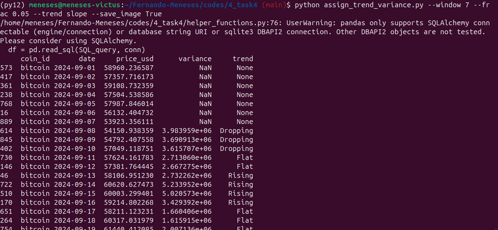

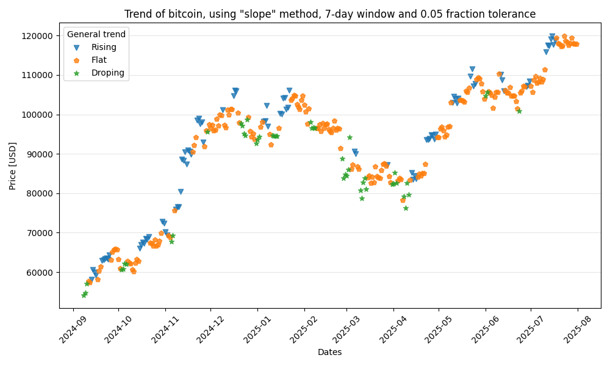

```shell
# Run from shell in ./codes/4_task4/ folder
python assign_trend_variance.py --window 7 --frac 0.05 --trend compare_extremes --plot_coin ethereum --save_image True
```

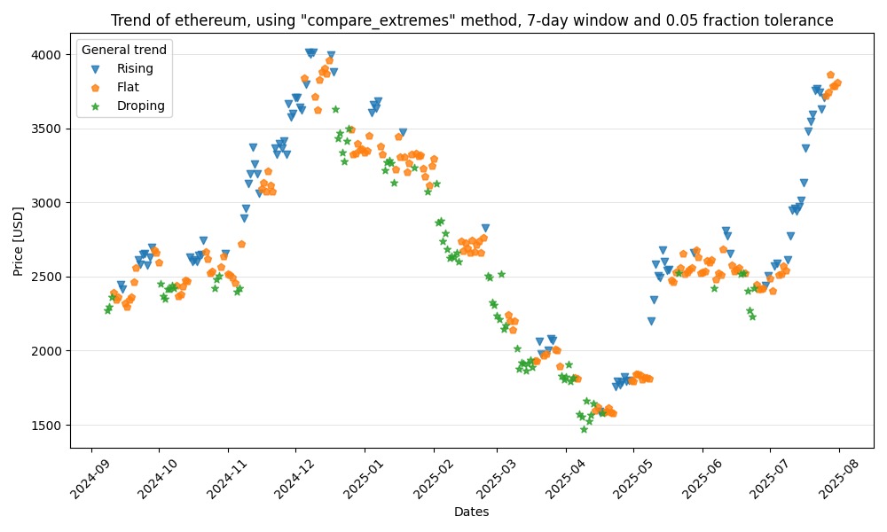

*Note: in all cases, the first `window` values (7 by default) are missing for the trend and variance values, as there is not enough information to calculate them*

#### Lagged prices and calendar features <a id="task4-lagged-prices"></a>

In this section, I work with lagged prices and calendar features:

<div style="background-color:#b6f08aff; padding:10px; border:1px solid #b6f08aff; border-radius:4px; color:#000; margin-bottom:15px;">

a. Instead of having only the price and date for each row, also include the price of the last 7 days as columns as well as the next day’s price, which will be used as a target variable.

b. Add any other time calendar features such as the day of the week, the month or holidays.

</div>


In the script `prepare_full_dataset.py`, I have included all possible feature engineering and transformations that are allowed to apply to the dataset. By default, all of them are applied with the standard criteria described before. Below, all original and new features are described for the daily datasets are described:

Original features:

- `coin_id`
- `date`
- `price_usd`

New features:

- `risk`: Coin risk based on dropping streaks. Options for `streak_days` (default: 1), `risk_period_days` (default: 30).
- `trend`: General trend that evaluates if the price is rising, dropping or just flat within a time window. Options for `trend_method` (default: slope), `window` (default: 7), `frac` (default: 0.05).
- `variance`: Price variance considered a time window. Options for `window` (default: 7).
- `price_usd-1`: 1-day lagged price, in USD.
- ...
- `price_usd-7`: 7-day lagged price, in USD.
- `is_weekend`: Whether a day is weekend-day (True) or not (False).
- `is_US_holiday`: Wwhether a day is a holiday in the US (True) or not (False).
- `is_China_holiday`: Wwhether a day is a holiday in China (True) or not (False).

Transformations:

- `risk`: mapped from ['Low','Medium','High] to [1,2,3], respectively.
- **Normalized prices**: if allowed, lagged prices are normalized by the `price_usd-1` feature. In that case, the original `price_usd-1` is duplicated as a new feature called `price_usd-1_orig`. This last feature will be used to recover a full price prediction later, otherwise the absolute information about prices is lost.

The script to build the full dataset is `prepare_full_dataset.py`, and it accepts each feature engineering process and method as separate inputs. By default, all transformations are set to False. The following example explains how to run the script:

```shell
# Run a shell from `./codes/4_task4/ folder and prompt:
python prepare_full_dataset.py \ # Basic command, can run as standalone
  --table <table> \ # Select either crypto_daily_table (default) or coin_data
  --apply_risk \ # Allow to apply risk assignments (default: False)
  --risk_streak_days <N> \ # Set option for dropping streak days in the risk assignment (default: 1)
  --risk_period_days <N> \ # Set option for evaluation period in the risk assignment (default: 30)
  --apply_trend_var \ # Allow to apply trend and variance assignments (default: False)
  --trend_method <N> \ # Set option for trending method in the trend/variance assignment (default: slope)
  --trend_var_window <N> \ # Set option for trend and variance window in the trend/variance assignment (default: 7)
  --trend_frac <f> \ # Set option for trending tolerance fraction in the trend/variance assignment (default: 0.05)
  --apply_lagged_prices \ # Allow to apply lagged prices assignments (default: False)
  --apply_calendar_features \ # Allow to apply calendar features (default: False)
  --apply_risk_mapping \ # Allow to make risk transformations (default: False)
  --apply_price_normalization # Allow to lagged prices normalization (default: False)
```

A few comments to understand how the script works:

- Some transformations are conditioned to others, for instance: calling `apply_risk_mapping` can only work if `apply_risk` was called, otherwise it has no effect. 
- All transformation methods are subjected to the transformation application. For example, setting `trend_var_window` to some value only makes sense when `apply_trend_var` is called.

If the reader wants to apply all transformation with the standard values, they should run the following script:

```shell
# Run a shell from `./codes/4_task4/ folder and prompt:
python prepare_full_dataset.py \
  --table crypto_daily_data \
  --apply_risk \
  --apply_trend_var \
  --apply_lagged_prices \
  --apply_calendar_features \
  --apply_risk_mapping \
  --apply_price_normalization
```

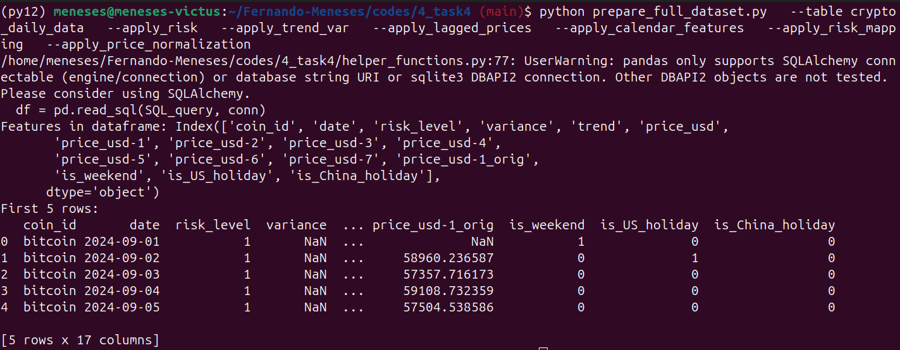

#### Machine Learning predictions <a id="task4-ML-predictions"></a>

Finally, let's make some price predictions!

<div style="background-color:#b6f08aff; padding:10px; border:1px solid #b6f08aff; border-radius:4px; color:#000; margin-bottom:15px;">
<p style="margin:0;">
For every (coin, date) row in the dataset with date T0, predict the next day's price (T1) based on the previous 7 days of the stock's price and the previous features.
</p></div>

For this stage, I will implement a relatively simple regression model. There are a lot of choices when designing a ML model, so I will explain some decisions:

**Multiple coins handling**:

- I can either train a model for all types of coins, or one model for each coin. Because coins seem to behave very differently and I suspect that there is not enough data to establish a correlations, I choose to train **one ML model for each coin**.

- **Train/test split: chronological**, to avoid look-ahead bias, 75% of the data (earliest) for training, 25% (latest) for testing.

- **Target: `price_usd`** (T0), normalized by price_usd-1_orig. At prediction time, the model output will be scaled back to absolute price using the formula:

pred_absolute = pred_normalized × price_usd-1_orig

**Features:**

I will keep all features as the ML model's inputs except for:

- ❌ `coin_id` (we train per coin)

- ❌ `date` (index or dropped)

- ❌ `price_usd-1_orig` (used only for scaling back predictions, not for training)

I prepared two simple ML models to be trained:

- Linear Regression
- RandomForestRegressor

The script `make_ML_predictions.py` processes the original cryptocurrency information making the selected transformations and then train and evaluate the chosen ML models. The script usage is the following:

```shell
# Run a shell from `./codes/4_task4/ folder and prompt:
python make_ML_predictions.py \ # Basic command, can run as standalone
  --table <table> \ # Select either crypto_daily_table (default) or coin_data
  --apply_risk \ # Allow to apply risk assignments (default: False)
  --risk_streak_days <N> \ # Set option for dropping streak days in the risk assignment (default: 1)
  --risk_period_days <N> \ # Set option for evaluation period in the risk assignment (default: 30)
  --apply_trend_var \ # Allow to apply trend and variance assignments (default: False)
  --trend_method <N> \ # Set option for trending method in the trend/variance assignment (default: slope)
  --trend_var_window <N> \ # Set option for trend and variance window in the trend/variance assignment (default: 7)
  --trend_frac <f> \ # Set option for trending tolerance fraction in the trend/variance assignment (default: 0.05)
  --apply_lagged_prices \ # Allow to apply lagged prices assignments (default: False)
  --apply_calendar_features \ # Allow to apply calendar features (default: False)
  --apply_risk_mapping \ # Allow to make risk transformations (default: False)
  --apply_price_normalization # Allow to lagged prices normalization (default: False)
  --allow_ML_Linear_Model \ # Allow to train and evaluate a Linear Regression model
  --allow_ML_RF_Model \ # Allow to train and evaluate a Random Forest (RF) Regressor model
  --RF_n_estimators \ # Set option for number of estimators in RF model
  --RF_max_depth \ # Set option for maximum depth in RF model
  --save_image # Allow to save the predictions vs ground truth results
```

If the reader wants to train all ML models using the default parameters, they should run the following script:

```shell
# Run a shell from `./codes/4_task4/ folder and prompt:
python make_ML_predictions.py \
  --table crypto_daily_data \
  --apply_risk \
  --apply_trend_var \
  --apply_lagged_prices \
  --apply_calendar_features \
  --apply_risk_mapping \
  --apply_price_normalization \
  --allow_ML_Linear_Model \
  --allow_ML_RF_Model
  --save_image True
```

Results for Linear Regression:

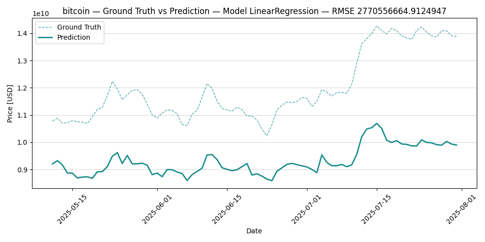

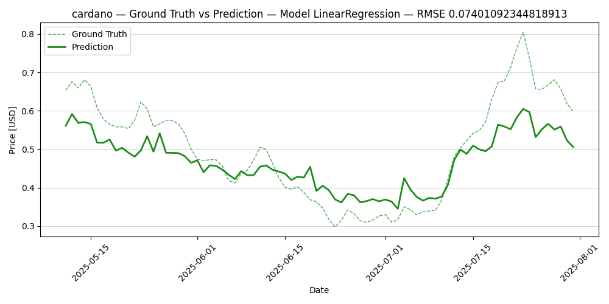

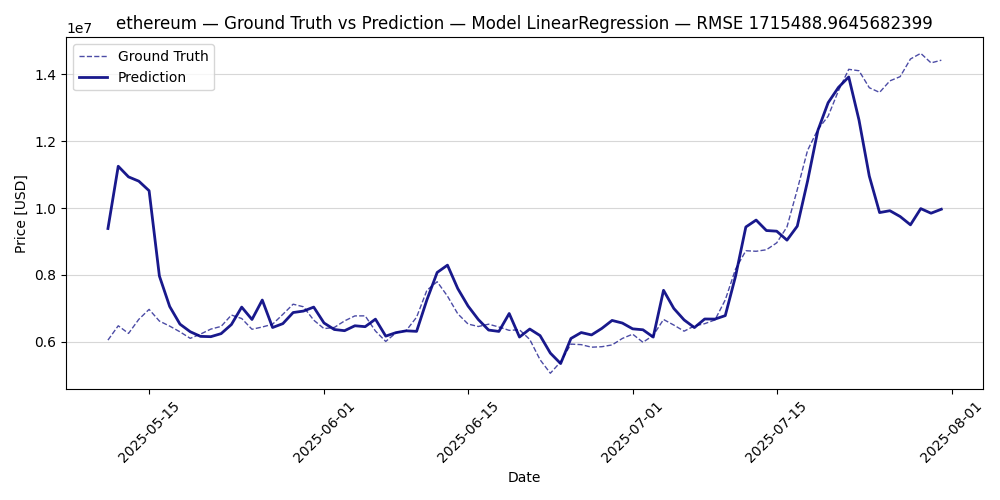

Models perform pretty well! I think that the bitcoin case is failing because of the normalization/rescaling process... the numbers are so big in the coin that any small mistake can produce large errors.

Results for Random Forest Regressor:

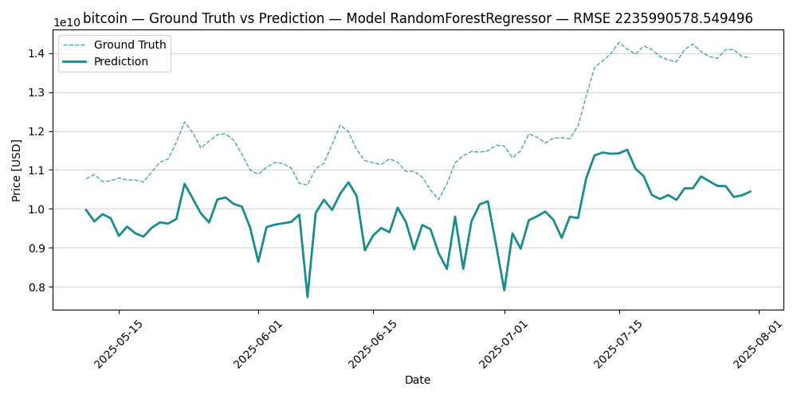

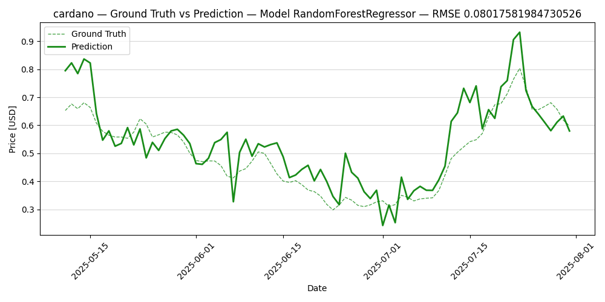

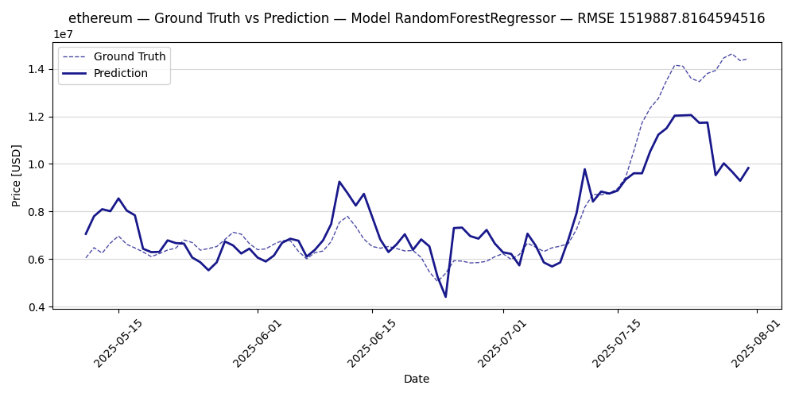

The results are summarized in this table, showin that the **Random Forest Regressor (RF)** performs better except for the `cardano` coin. However, the RF can be still optimized, so better performance can be expected.

| Coin     | Model                     | RMSE (test dataset) |
|----------|---------------------------|---------------------|
| bitcoin  | LinearRegression          | 2.8E8               |
| bitcoin  | **RandomForestRegressor** | 2.2E8               |
| ethereum | LinearRegression          | 1.7E6               |
| ethereum | **RandomForestRegressor** | 1.5E6               |
| cardano  | **LinearRegression**      | 0.07                |
| cardano  | RandomForestRegressor     | 0.08                |

## Conclusions <a id="conclusions"></a>

We have come to the end! From beginning to end, I built a pipeline that ingests data from cryptocurrency prices, loads it into a postgres database, analyzes and transforms it with SQL commands, and finally makes a feature engineering process. After the data is fully processed, I explored two different ML models that performed pretty well making future predictions.

Along the process, I've interacted with an API and operated with a database. The codes were built in a modular fashion, allowing them to run in docker containers, and setting a wide variety of options for the users.

Finally, in the data engineering process and ML designs, I focused on making functional scripts and visualize the data as I process it. In that sense, I hope that you enjoyed reading this notebook, I tried to do it as clear as possible, including examples and guides.

As always, there is room for improvement, and in the following section I explain some of the ideas that I have that can enhance the project. Thanks for your attention!!

## Upgrade perspectives <a id="perspectives"></a>

### Easier interfacing for users <a id="p0interfacing"></a>

Right now, all source codes are run in dockers. However, because some dockers can't see resources outside them, users have to manually input some parameters, for example in Stage 1:

```shell
docker run --rm --env-file "$(realpath ../../.env)" -u $(id -u):$(id -g) -v "$(pwd)/crypto_datafiles:/app/crypto_datafiles" api_request:latest --bulk --start 2024-09-01 --end 2025-07-31 bitcoin
```

Here, the user has to specifically map the local data files `$(pwd)/crypto_datafiles` to the docker working folder. A better solution could be design, maybe using Docker compose and setting all docker permissions and resources beforehand.

### Stage 1: Skip duplicates <a id="perspectives1"></a>

Currently, my script gets all the requested data and overwrites the existing information in the output folder. Taking into consideration that CoinGecko limits the frequency for requests, it would be very useful to skip those files that are already downloaded. This could be implemented in the script, by just **checking before the request if the future output file is already in the output folder, in which case the request is skipped**. 

### Stage 2: API+Postgres Integration <a id="perspectives2"></a>

Currently, my workflow first downloads information from CoinGecko API to local files, and then uploads that information to a Postgres database. An optional functionality could be implemented to directly load the Postgres database from the API, without the need of storing local files.

### Stage 3: Missing values sanity check <a id="perspectives3"></a>

In Stage 3, the streaks must be calculated over a continuous period of time, then there cannot be missing values in the data. Alternatively, the time period can be restricted to the largest continuous interval. In the future, it would be helpful to implement a sanity check step, and either fill the missing values with some criteria, or deny the request if there are missing values in the dataset.

### Stage 4: Dockerization and XGBRegressor <a id="perspectives4"></a>

For this stage, I have chosen to use python scripting, without dockerization. Because the scripts are designed modularly, setting environmental variables and database connections can be repetitive and messy if not done properly. In the future, a proper dockerization, probably using Docker compose, can be implemented.

Regarding the ML training options, I chose to develop two simple options for the models, but the XGBRegressor should be easy to implement and has a lot of potential.

## License <a id="license"></a>

This project is licensed under the MIT License. You can learn more about it in the following link: [MIT license - Wikipedia](https://en.wikipedia.org/wiki/MIT_License).

[⬆️ Back to top](#top)